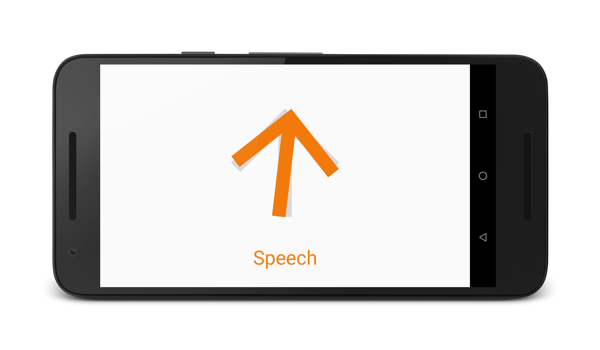

# Kiko Android

Android app that classifies sounds and localizes their sources. Android riff on [Kiko Glasses](http://tkunic.me/blog/kiko-glasses).

**Warning:** Kiko Android is NOT robust enough to be used as an assistive technology in the real world yet, and is just a proof-of-concept at this stage.

## Localization

This app localizes sounds by measuring the time delay of sound reaching two microphones. Using that delay, one can narrow down the sound source location to a surface in 3D space. But unfortunately, that surface consists of infinitely many points: to narrow the location down to a single point in 3D space, more microphones are required (Kiko Glasses had four, whereas phones tend to have at most two). Luckily, we can work around this limitation by making some assumptions:

1. Assume the user only cares about the *direction* (a vector) the sound is coming from.
2. Assume all sound originates in a plane.
3. Assume all sound will come from somewhere in front of the phone, as opposed to behind it.

These assumptions allow us to usefully tell the user "where" the sound is coming from by providing a vector tangential to the surface, pointing away from the user, and on the phone screen's plane.

Note that Kiko Android only works on Nexus 5X phones for now, because that's all I've had available to test with. However, adding support for other phones isn't really difficult: the only real prerequisite is that the phone has two microphones that are reasonably far apart. If you wish to help and add support for other phones, please open an issue and in it specify: (1) the phone model, (2) the distance between its two microphones in millimeters.

## Classification

Classification and the app itself are based on [TensorFlow's Speech Commands Demo](https://github.com/tensorflow/tensorflow/tree/master/tensorflow/examples/android). It uses a simple spectrogram classifier based on [this paper](http://www.isca-speech.org/archive/interspeech_2015/papers/i15_1478.pdf). I trained the network on the [UrbanSound8k dataset](https://serv.cusp.nyu.edu/projects/urbansounddataset/urbansound8k.html) + the speech files sampled from the [Speech Commands Dataset](https://storage.cloud.google.com/download.tensorflow.org/data/speech_commands_v0.01.tar.gz).
